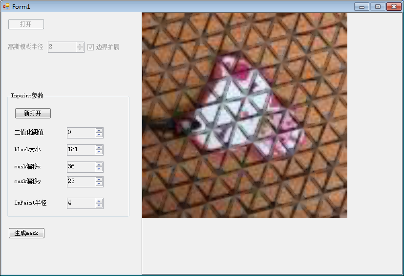
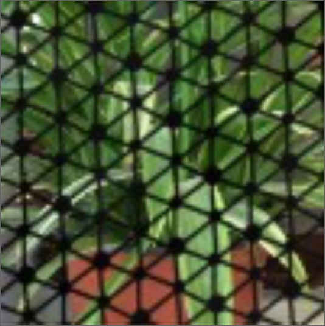
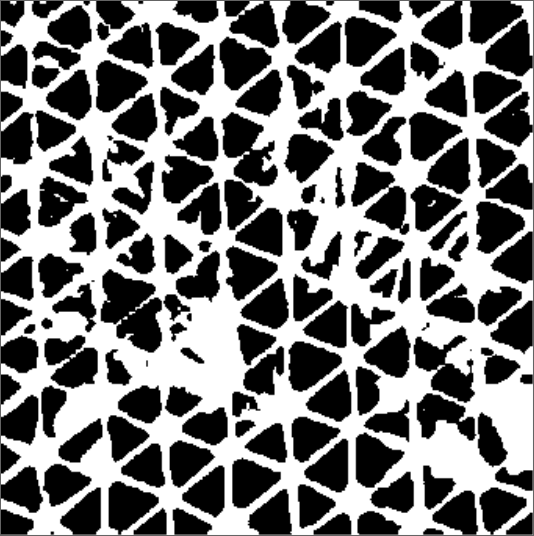
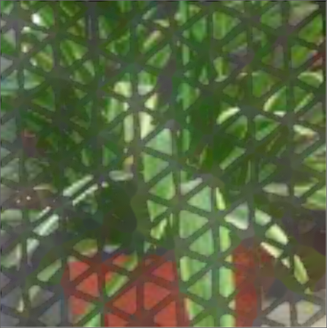
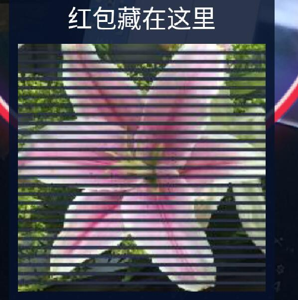
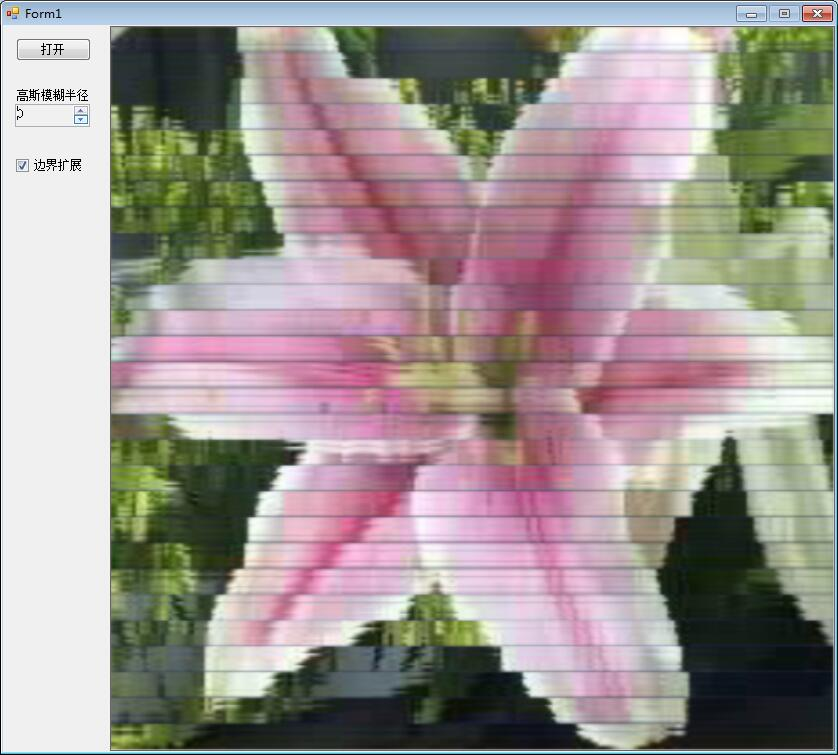

## update 0.4

mask如果从原图中提取，很不精确，仔细看了下网格，还是有规律的；

研究一下网格的规律，搞一套固定模式的mask。

1. 圆点分大和小两种
2. 考虑以大圆点为中心的六边形，所有这种六边形是一致的（目测）。
3. 生成六边形，然后平铺

效果

后续:提高mask的准确度;inpaint算法的参数优化

## update 0.3

处理过程，首先裁剪出小图；

用这个图生成灰度图，然后使用ThresholdAdaptive进行二值化，生成mask；

用mask以及原图，进行inpaint。

原图

mask

处理后

效果还是很差，后面进行参数调优。

## update 0.2

opencv+emgu环境搞了半天，最终使用libemgucv-windows-universal-cuda-2.4.10.1940-selfextract-zip把helloworld跑通了，mark下。。

1. 首先安装libemgucv，然后在项目中引用Emgu.CV.dll，Emgu.CV.UI.dll，Emgu.Util.dll；
2. using using Emgu.CV;using Emgu.Util;using Emgu.CV.Structure;using Emgu.CV.Util;
3. 复制emgu\bin\x86下所有dll文件到项目bin/debug目录下
4. 可以开发

## update 0.1

图片上黑条变成了网状，不好搞了。

先不搞这个了，了解一下opencv里的inpaint先。。。

-----
old
-----

## 功能

支付宝最近出了VR红包，看了一下，发现很容易破解，搞个小软件玩玩

（作废）填补算法是，定位到黑条，用黑条相邻的两块图片区域来填补黑条，最后进行高斯模糊处理。

## 一些信息（作废）

以下数据根据小米5算的，有兴趣的可以对自己手机做适配

手机屏幕分辨率：1080*1920

图片大小：420*420，位置：（330,1071）

h是上下两个图片区域的高度，x是黑条个数；黑条高度8，图片高度7；

420 = h×2+8×x+7×(x-1)   

420 = 11×2+8×27+7×26

## PS

本来想着好好捞一笔，结果发现每天限抢10个。。。哭晕在厕所。。。

估计很快会被封堵。。。（已在封堵）

后面搞一下手机模拟定位就爽了:

xposed+模拟位置+http://api.cellocation.com/recell.html

## 示意图

原图

处理后

